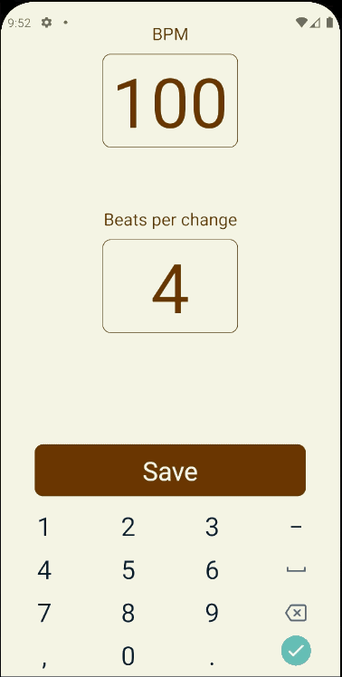
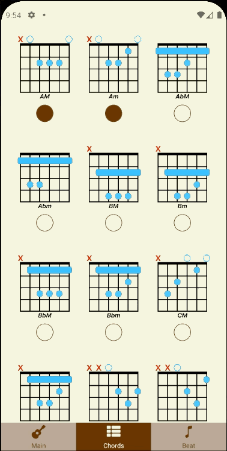
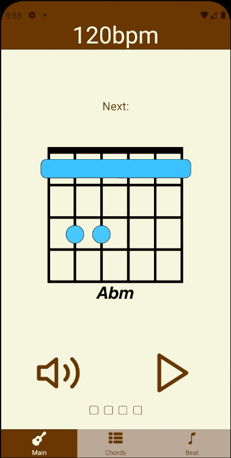

## Select chords to practice and play in time with the beat

---

### Select BPM and beats per chord change

---

### Select the chords to practice

---

### Start practising! On the final beat, play the chord that is displayed. A new one will be generated - get ready to play that one next.

